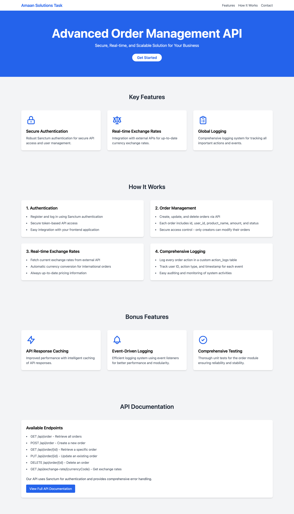

## **📖 Index**

**[Task Overview](#task-overview)**  
**[TODO List](#todo-list)**  
**[API Documentation](./api-documentation.md/#order-api-documentation)**

### Task Overview

```
You will build a simple order management system where users can:

* Register and log in (Sanctum authentication).
* Create, update, and delete orders.
* Fetch real-time exchange rates from an external API.
* Implement global logging for important actions.

Authentication

Use Laravel Sanctum for API authentication.
Orders API

Implement CRUD operations for orders.
An order should have: id, user_id, product_name, amount, and status.
Ensure only the creator of an order can update or delete it.

Global Logging

Log every order action (create, update, delete) in a custom action_logs table.
Each log should store the user ID, action type, and timestamp.
Bonus (If You Want to Impress Us) 🚀

Implement caching for API responses.
Use event listeners for logging instead of directly writing in controllers.
Add unit tests for the order module.
```

## Get Started

Composer Install

```bash
composer install
```

Create Env File by Copying ``.env.example``

```bash
cp .env.example .env
```

Generate app key

```bash
php artisan key:generate
```

Create SQLite Database

```bash
touch database/database.sqlite
```

Start Server

```bash
php artisan serve
```

## Task Done Checklist

#### Authentication

☑️ Laravel Sanctum configured for API authentication.  
☑️ User registration and login functionality implemented.

#### **Orders API**

☑️ CRUD operations for orders completed.  
☑️ Orders have required fields: **id, user_id, product_name, amount, and status**.  
☑️ Access control implemented: **Only order creators can update or delete their orders**.

#### **Real-Time Exchange Rates**

☑️ Integrated external API to fetch real-time exchange rates.

#### **Global Logging**

☑️ Created **custom `action_logs` table** for logging order actions.  
☑️ Successfully logging **create, update, and delete actions** with user ID, action type, and timestamp.

#### **Performance Optimization**

☑️ Implemented **caching for API responses** to reduce database queries and improve response time using ``Cache``.  
☑️ Used **Model Observers (`Oberservers/OrderObserver.php`)** to handle logging efficiently instead of writing logic in
controllers.

#### **Testing & Reliability**

☑️ Developed **unit tests** for the Order API to ensure stability and correctness.

```bash
php artisan test
```

---

### Home Page Preview (Dummy Page)



